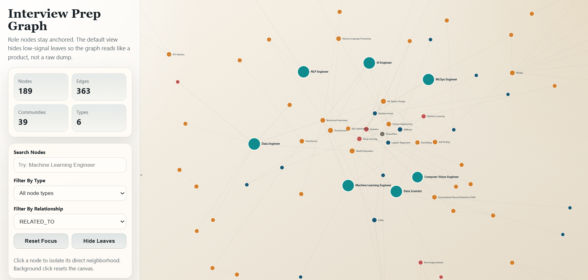

# Interview Prep GraphRAG

A role-centered knowledge graph built from interview-prep articles for:

- Machine Learning Engineer
- AI Engineer
- Data Scientist
- MLOps Engineer
- Data Engineer
- NLP Engineer
- Computer Vision Engineer

The project scrapes interview guides, roadmaps, question banks, and study resources, then turns them into a graph of roles, topics, skills, tools, algorithms, and recommended resources. It also exports a deployable static HTML graph for exploration.

## UI Preview



## What This Project Does

This project answers questions like:

- What should I study for Machine Learning Engineer interviews?
- What overlaps between Data Scientist and Machine Learning Engineer prep?
- Which topics are central to MLOps or AI Engineer preparation?
- Which resources are repeatedly recommended for a given role?

Instead of treating the corpus as plain text, the pipeline builds a structured graph with relationships such as:

- `JOB_ROLE -> REQUIRES -> SKILL`
- `JOB_ROLE -> TESTS -> INTERVIEW_TOPIC`
- `JOB_ROLE -> USES -> TOOL / ALGORITHM`
- `RESOURCE -> RECOMMENDED_FOR -> JOB_ROLE`

## Current Snapshot

From the current run in this repo:

- `109` candidate URLs collected
- `56` kept after filtering
- `189` graph nodes
- `363` graph edges
- `39` communities after graph tightening

Kept role coverage:

- Machine Learning Engineer: `14`
- Computer Vision Engineer: `8`
- Data Scientist: `8`
- NLP Engineer: `8`
- AI Engineer: `7`
- Data Engineer: `6`
- MLOps Engineer: `5`

## Pipeline

### 1. Search and scrape

The scrape notebook uses **SerpAPI Google Search** with role-focused interview-prep queries, then scrapes article text with `trafilatura`.

### 2. Clean and filter

The corpus is filtered to remove:

- blocked domains
- obvious non-article or job-posting pages
- thin pages
- weak interview-signal content
- failed scrapes

### 3. Build the graph

The graph notebook uses:

- `LlamaIndex PropertyGraphIndex`
- a custom `GraphRAGExtractor`
- a custom `GraphRAGStore`

Entity types:

- `JOB_ROLE`
- `INTERVIEW_TOPIC`
- `SKILL`
- `TOOL`
- `ALGORITHM`
- `RESOURCE`

Relationship types:

- `TESTS`
- `REQUIRES`
- `USES`
- `RELATED_TO`
- `RECOMMENDED_FOR`

### 4. Summarize communities

The system runs community detection, summarizes each cluster, and uses those summaries for final question answering.

### 5. Export a static graph

The final outputs are:

- [interview_prep_corpus.csv](<\\?\UNC\wsl.localhost\Ubuntu\home\shubh\graphRAG\interview_prep_corpus.csv>)
- [interview_graph_data.json](<\\?\UNC\wsl.localhost\Ubuntu\home\shubh\graphRAG\interview_graph_data.json>)
- [job_skill_graph.html](<\\?\UNC\wsl.localhost\Ubuntu\home\shubh\graphRAG\job_skill_graph.html>)

## Repo Structure

```text
.
|-- scrape_interview_prep.ipynb
|-- build_interview_graphrag.ipynb
|-- interview_prep_corpus.csv
|-- interview_graph_data.json
|-- job_skill_graph.html
|-- search.csv
|-- raw.csv
`-- .env
```

## How To Run

### Requirements

- Python 3.10+
- SerpAPI key
- OpenAI API key

### `.env`

```env
SERP_API_KEY=your_serpapi_key
OPENAI_API_KEY=your_openai_api_key
```

### Order

1. Run [scrape_interview_prep.ipynb](<\\?\UNC\wsl.localhost\Ubuntu\home\shubh\graphRAG\scrape_interview_prep.ipynb>)
2. Run [build_interview_graphrag.ipynb](<\\?\UNC\wsl.localhost\Ubuntu\home\shubh\graphRAG\build_interview_graphrag.ipynb>)
3. Open [job_skill_graph.html](<\\?\UNC\wsl.localhost\Ubuntu\home\shubh\graphRAG\job_skill_graph.html>)

## Models

- `gpt-4o-mini` for entity and relationship extraction
- `gpt-4o-mini` for community summaries
- `gpt-4o` for final query synthesis

## Main Challenges

- Job postings were too noisy for this use case, so the project pivoted to interview-prep articles.
- Many search results from sites like Reddit, LinkedIn, and Medium were hard to scrape reliably.
- Early graph versions were too fragmented, with too many weak nodes and tiny communities.
- Visualization quality mattered a lot: a technically correct graph was still hard to use until the layout became role-centered and interaction-first.

## What Improved In The Final Version

- better filtering of scraped pages
- stronger role coverage across the corpus
- graph tightening to remove low-signal structure
- fewer communities and less clutter
- a cleaner HTML graph with:
  - larger role nodes
  - role anchors that never disappear
  - click-to-focus neighborhoods
  - relation and type filters
  - grouped node details

## Tech Stack

- SerpAPI
- `requests`, `BeautifulSoup`, `trafilatura`
- `pandas`
- LlamaIndex `PropertyGraphIndex`
- OpenAI `gpt-4o-mini`, `gpt-4o`
- `graspologic`
- D3.js

## Acknowledgment
This project was built with development assistance from OpenAI's ChatGPT (GPT-5.4). It was used to help with implementation, debugging, and iteration during development.
