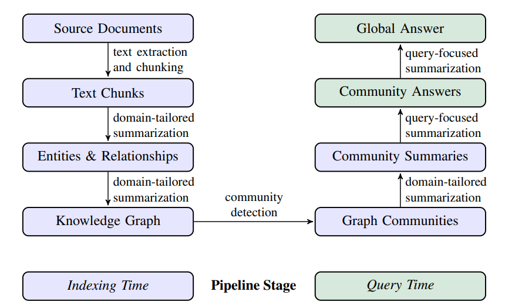

## What GraphRAG is

GraphRAG is a graph-based form of retrieval-augmented generation. Instead of only retrieving semantically similar text chunks the way baseline vector RAG usually does, it first builds a knowledge graph from the corpus, then organizes that graph into communities, writes summaries for those communities, and uses those graph structures plus summaries at query time. Microsoft’s docs describe it as a structured, hierarchical alternative to naïve snippet-based RAG. (https://microsoft.github.io/graphrag/)

The original Microsoft paper positions GraphRAG as a solution to a specific weakness of normal RAG: it often struggles on global corpus questions such as “What are the main themes in this dataset?” because those are really query-focused summarization problems, not just retrieval problems. In the paper’s evaluation, GraphRAG improved comprehensiveness and diversity over a conventional RAG baseline on global sensemaking questions over datasets around the 1 million token scale.(https://arxiv.org/pdf/2404.16130)

## Why people built it

Baseline RAG is good when the answer lives in a few relevant passages, but it often fails when the model must:

1. connect facts scattered across many documents, or
2. form a high-level synthesis of a whole corpus.

Microsoft Research explicitly calls out both of those failure modes: “connect the dots” questions and holistic understanding over large document collections or large single documents. GraphRAG was introduced to improve those cases by making structure explicit through a graph and summaries.

```
GraphRAG = RAG + an LLM-built knowledge graph + community detection + precomputed summaries.
```

## How it works


Image source: https://arxiv.org/pdf/2404.16130

## When GraphRAG is probably overkill

GraphRAG is not automatically the best choice for every RAG problem. If your use case is mostly “find the exact paragraph answering a narrow question,” standard vector search or hybrid RAG may be simpler and cheaper. Microsoft’s own repo warns that indexing can be expensive and recommends starting small.

A good rule of thumb:

1. small corpus + direct factual lookup → baseline/hybrid RAG may be enough
2. large corpus + synthesis + cross-document reasoning → GraphRAG becomes attractive

source: https://github.com/microsoft/graphrag/blob/main/RAI_TRANSPARENCY.md#what-are-the-limitations-of-graphrag-how-can-users-minimize-the-impact-of-graphrags-limitations-when-using-the-system